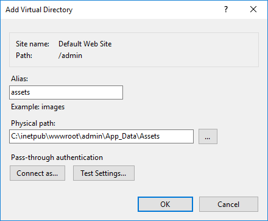
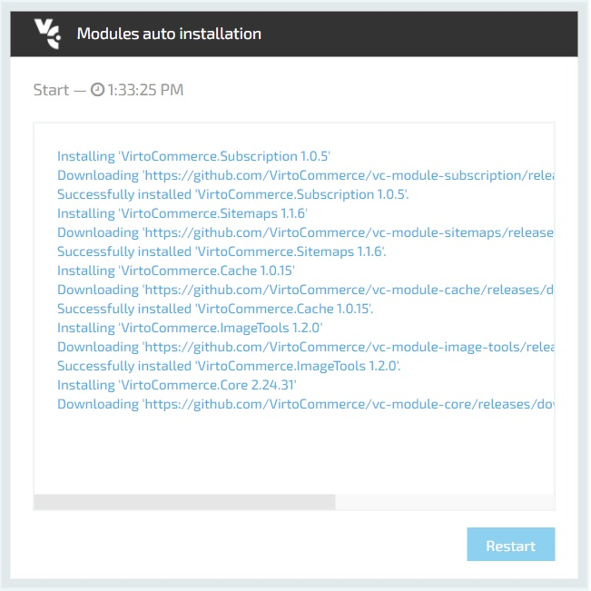
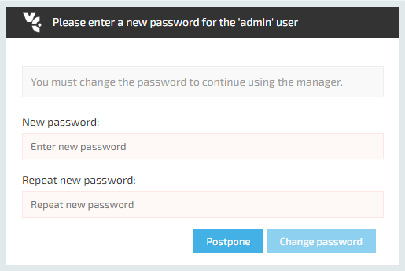
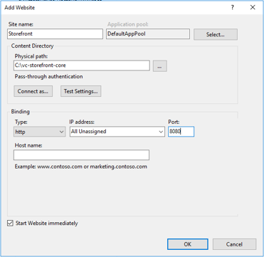

## Summary

Use this guide to <a class="crosslink" href="https://virtocommerce.com/ecommerce-hosting" target="_blank">deploy</a> and configure precompiled Virto Commerce Platform (backend) and Virto Commerce Storefront (frontend).

## Video
* <a href="https://www.youtube.com/watch?v=oRL2jxv2Knc" target="_blank">Part 1. How to deploy and configure Virto Commerce Platform</a>
* <a href="https://www.youtube.com/watch?v=QuA1ATgzWwc" target="_blank">Part 2. How to deploy and configure Virto Commerce Storefront</a>

## Prerequisites

* [Windows Server 2008 R2 SP1 or later](https://www.microsoft.com/en-us/evalcenter/evaluate-windows-server-2016)
* Enable Internet Information Services. You may use PowerShell command:

```
Install-WindowsFeature -name Web-Server -IncludeAllSubFeature
```

* [Microsoft .NET Framework 4.6.1](https://www.microsoft.com/en-us/download/details.aspx?id=49981)
* [Microsoft SQL Server 2008 or later](https://www.microsoft.com/en-us/evalcenter/evaluate-sql-server-2017-rtm) with SQL Management Studio(free MS SQL Express would be enough)
* [Visual C++ Redistributable Packages for Visual Studio](https://go.microsoft.com/fwlink/?LinkId=746572)
* [Prerequisites for .NET Core on Windows](https://docs.microsoft.com/en-us/dotnet/core/windows-prerequisites)
* [.NET Core Runtime](https://dotnet.microsoft.com/download)

## Initial configuration of VirtoCommerce Platform (backend)

Navigate to the <a href="https://github.com/VirtoCommerce/vc-platform/releases" rel="nofollow">Releases section of Virto Commerce Platform in GitHub.</a>

You will find and download **VirtoCommerce.Platform.2.x.x.zip** file.

Unpack follow zip to the web server in IIS application root directory **C:\inetpub\wwwroot\admin**. If there is no **admin** directory inside **wwwroot**, create it manually or with PowerShell commands:

```
$folder="C:\inetpub\wwwroot\admin"
New-Item -ItemType directory -Path $folder -Force
```

## Setup of Virto Commerce Platform

### Configure connection strings

* Open the **C:\inetpub\wwwroot\admin\Web.config** file in a text editor.
* In the **connectionStrings** section find the **add** node:
  
  **VirtoCommerce**: parameters for  SQL server database. Change (local) to IP address of your SQL Server. For locally running instance   SQL Express set **Data Source=.\SQLEXPRESS**.
  
```
  <add name="VirtoCommerce" connectionString="Data Source=(local);Initial Catalog=VirtoCommerce2;Persist Security Info=True;User       ID=virto;Password=virto;MultipleActiveResultSets=True;Connect Timeout=420" providerName="System.Data.SqlClient" />
```

### Create virto user in SQL Server Manager

* Open SQL Server Manager and connect to the local sql server on Database Engine. Add to Security/Logins new login name virto with password virto, give him in Server Roles dbcreator and public roles.

### Configure permissions for admin folder of VirtoCommerce Platform

Open properties for **C:\inetpub\wwwroot\admin** folder and give permission **Modify** to **IIS_IUSRS** user group.


The same can be done with PowerShell commands:

```
$acl = Get-Acl $folder
$acl.SetAccessRuleProtection($True, $True)
Set-Acl -Path $folder -AclObject $acl
$permission = "BUILTIN\IIS_IUSRS","Modify, Synchronize", "ContainerInherit, ObjectInherit", "None", "Allow"
$accessRule = New-Object System.Security.AccessControl.FileSystemAccessRule $permission
$acl.SetAccessRule($accessRule)
$acl | Set-Acl $folder
```

### Configure IIS

* Open the **IIS Manager** and create a new application named **admin** inside an existing **Default Web Site**.
* In the **Physical path** field enter the full path to the platform site data folder **C:\inetpub\wwwroot\admin**.


* Select application pool named DefaultAppPool which uses **.NET CLR Version 4.0** and **Integrated** pipeline mode.
* Inside the admin application add the new virtual directory with alias **assets** and physical path **C:\inetpub\wwwroot\admin\App_Data\Assets**. If there is no **Assets** directory inside **App_Data**, create it manually or with PowerShell commands:

```
$folder="C:\inetpub\wwwroot\admin\App_Data\Assets"
New-Item -ItemType directory -Path $folder -Force
```



## First sign in

* Open the Virto Commerce Platform application in the browser - in  the **IIS Manager** select **admin** and click on right column to "Browse *:80(http)".
* **On the first request the application will create and initialize Virtocommerce2 database**. Wait a minute...
* After that you should see the sign in page.


* Use the following credentials:
  * Login: **admin**.
  * Password: **store**.

## Modules auto installation

* Next step - platform modules auto installation, after that you should click the **Restart** button.



## Sample data installation

* After restart you should see next page with possibillity to sample data installation (you should choose **Closing and Electronics** option - new products would be added to your **Virtocommerce2** database).


## Change administrator password

After **Sample data installation** step completed user is forced to change the password.



## Change frontend password

* In the left menu select **More > Configuration > Security**.
* Select **Users**.
* Select the **frontend** user.
* Click **Change password**.
* Enter the new password twice and click **OK**.

## Change API credentials for storefront application

* In the left menu select **More > Configuration > Security**.
* Select **Users**.
* Select the **frontend** user.
* Click the **API Keys** widget.
* Select the **Frontend Hmac** key.
* Click **Generate**, then **OK**, then **Save**.

## Initial configuration of VirtoCommerce Storefront (frontend)

Navigate to the <a href="https://github.com/VirtoCommerce/vc-storefront-core/releases">Releases section of Virto Commerce Storefront in GitHub.</a>

You will find and download **VirtoCommerce.Storefront.4.x.x.zip** file.

Create new folder named **C:\vc-storefront-core** manually or with PowerShell commands:

```
$folder="C:\vc-storefront-core"
New-Item -ItemType directory -Path $folder -Force
```

and unpack this zip file to this folder of web server.

## Setup of Virto Commerce Storefront

### Configuring VirtoCommerce Platform Endpoint

* Open the **C:\vc-storefront-core\appsettings.json** in a text editor.
* In the **VirtoCommerce** section find the node named **Endpoint**. Make sure that its **Url** attribute value is **http://localhost/admin**.
* Make sure that **AppId** and **SecretKey** attributes values is set to the values obtained earlier in the **Change API credentials for storefront application** step.
  
```
...
"VirtoCommerce": {
    "Endpoint": {
        //Virto Commerce platform manager url
        "Url": "http://localhost/admin",
        //HMAC authentification user credentials on whose behalf the API calls will be made.
        "AppId": "Enter your AppId here",
        "SecretKey": "Enter your SecretKey here",
    }
...
```

### Configure CMS content storage

* Open the **appsettings.json** in a text editor.
* In the **ConnectionStrings** section find the attribute named **ContentConnectionString**. Make sure that its rootPath value is **~/App_Data/cms-content**.

```
...
"ConnectionStrings": {
    //For themes stored in local file system
    "ContentConnectionString": "provider=LocalStorage;rootPath=~/cms-content"
  }
...
```

Platform already contains `~/App_Data/cms-content` folder with themes for sample stores it was configured earlier in the **Configure IIS** step
You need to make symbolic link to this folder by this command:

```
mklink /d C:\vc-storefront-core\wwwroot\cms-content C:\inetpub\wwwroot\admin\App_Data\cms-content
```

### Running the Storefont

There are 2 options for launching the application:

* Running the Storefont by CLI "dotnet run".
* Deploying the Storefont to IIS.

#### Running the Storefont by CLI "dotnet run"

* Open command prompt console.
* Change working directory to the **C:\vc-storefront-core**.

```
cd C:\vc-storefront-core
```

* Run the Storefront by following command:

``` 
dotnet.exe C:\vc-storefront-core\VirtoCommerce.Storefront.dll
```
The output in the console will say something like:
```
Now listening on: http://localhost:5000
```

#### Running the Storefont by IIS

* Restart IIS service.

```
net stop was /y
net start w3svc
```

* Open *IIS Manager* and add a new Website named **Storefront**.
* Select application pool named **DefaultAppPool**.
* In the Physical path field enter the full path to the storefront folder **C:\vc-storefront-core**.
* In the Port field enter the new Web site port binding **8080**.




Now you could first open the local **VirtoCommerce Storefront** instance for the first time.
Navigate to:

* http://localhost:5000 if the application deployed by "dotnet run";
* or http://localhost:8080 in case IIS.


